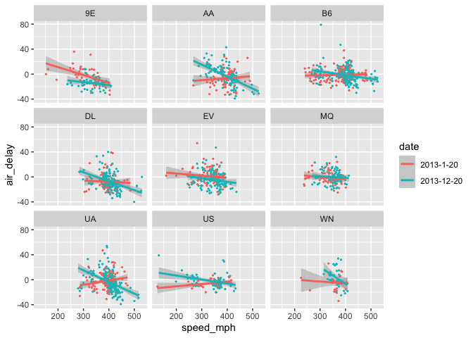

Using the tidyverse!
================
Beau Larkin
2021-04-05

-   [Description](#description)
-   [Engagement](#engagement)
    -   [Here’s what I think:](#heres-what-i-think)
    -   [A *paradigm*???](#a-paradigm)
-   [Tidy data](#tidy-data)
    -   [Examples: messy data](#examples-messy-data)
    -   [Tidy data rules:](#tidy-data-rules)
-   [Pipes!!](#pipes)
    -   [With pipes:](#with-pipes)
    -   [First position rule and the placeholder
        “.”](#first-position-rule-and-the-placeholder-)
-   [Verbs](#verbs)
    -   [All verbs in the tidyverse:](#all-verbs-in-the-tidyverse)
    -   [Verb: `glimpse()`](#verb-glimpse)
    -   [Verb: `filter()`](#verb-filter)
    -   [Verb: `select()`](#verb-select)
    -   [Verb: `mutate()`](#verb-mutate)
    -   [Verbs: `group_by()` and
        `summarize()`](#verbs-group_by-and-summarize)
-   [Combine verbs for EDA (exploratory data
    analysis)](#combine-verbs-for-eda-exploratory-data-analysis)
-   [Wrapping up](#wrapping-up)
-   [Homework](#homework)
    -   [Transform a messy data frame into a tidy
        tibble](#transform-a-messy-data-frame-into-a-tidy-tibble)
    -   [Are aphids more numerous on taller
        plants?](#are-aphids-more-numerous-on-taller-plants)
    -   [Tidy vs. messy](#tidy-vs-messy)
    -   [Bonus challenge](#bonus-challenge)

# Description

-   For University of Montana Course BIOB-595 - Art Woods, professor
-   2021-04-05 - Beau Larkin (guest instructor)

**Goals:**

-   Show some features of the tidyverse
-   Convince you that it’s at least worth your time to learn more
-   Give you some tools for further exploration
-   != flexing huge skills

This session borrows heavily from [*R for Data
Science*](https://r4ds.had.co.nz/index.html) (R4DS) by Wickham and
Grolemund, 2017, O’Reilly, and from other sources as annotated in-text.

BTW What is this \#’ thing? It’s useful. I’ll show you at the end.

Let’s get started!

``` r
# Package and library installation
packages_needed = c("tidyverse", "knitr", "nycflights13")
packages_installed = packages_needed %in% rownames(installed.packages())

if (any(! packages_installed))
    install.packages(packages_needed[! packages_installed])
for (i in 1:length(packages_needed)) {
    library(packages_needed[i], character.only = T)
}
```

    ## ── Attaching packages ─────────────────────────────────────── tidyverse 1.3.0 ──

    ## ✓ ggplot2 3.3.3     ✓ purrr   0.3.4
    ## ✓ tibble  3.1.0     ✓ dplyr   1.0.5
    ## ✓ tidyr   1.1.3     ✓ stringr 1.4.0
    ## ✓ readr   1.4.0     ✓ forcats 0.5.1

    ## ── Conflicts ────────────────────────────────────────── tidyverse_conflicts() ──
    ## x dplyr::filter() masks stats::filter()
    ## x dplyr::lag()    masks stats::lag()

# Engagement

What do you know about the tidyverse? Chat three words… Do you use
tidyverse packages and functions? Which packages?

## Here’s what I think:

-   It’s more than a collection of functions and fads (con sarn it,
    these new-fangled pipes!)
-   A paradigm for data science, and it’s here to stay
-   Why tidyverse? It allows us to use intuitive, linear processes to
    get answers and results from data quickly

## A *paradigm*???

What do you need before creating graphics, applying models, and testing
hypotheses?

-   …
-   The 80/20 rule…

# Tidy data

-   Chapter 12 in R4DS
-   *Tidy Data* in the [Journal of Statistical Software, Wickham
    2014](https://www.jstatsoft.org/article/view/v059i10).
-   You cannot pass into the tidyverse without tidy data! (whoa, that’s
    biblical, but seriously things don’t work well in the tidyverse with
    messy data)

“Tidy data are tidy in the same way. Each messy dataset is messy in it’s
own way.” - Wickham

## Examples: messy data

``` r
ex_1 <- data.frame(
    plot_replicate = paste(rep(LETTERS[1:5], each = 4), rep(1:4, 5), sep = "_"), 
    date = rep("2016-06-12", 20),
    measurement_1 = rbinom(20, 50, 0.2)
)
ex_1[20, 2] <- "2016-06-12, measured after lunch"
kable(ex_1)
```

| plot\_replicate | date                             | measurement\_1 |
|:----------------|:---------------------------------|---------------:|
| A\_1            | 2016-06-12                       |             12 |
| A\_2            | 2016-06-12                       |              9 |
| A\_3            | 2016-06-12                       |              7 |
| A\_4            | 2016-06-12                       |             11 |
| B\_1            | 2016-06-12                       |              9 |
| B\_2            | 2016-06-12                       |              5 |
| B\_3            | 2016-06-12                       |              6 |
| B\_4            | 2016-06-12                       |             10 |
| C\_1            | 2016-06-12                       |              4 |
| C\_2            | 2016-06-12                       |              6 |
| C\_3            | 2016-06-12                       |             10 |
| C\_4            | 2016-06-12                       |              6 |
| D\_1            | 2016-06-12                       |              9 |
| D\_2            | 2016-06-12                       |              6 |
| D\_3            | 2016-06-12                       |              5 |
| D\_4            | 2016-06-12                       |              6 |
| E\_1            | 2016-06-12                       |             13 |
| E\_2            | 2016-06-12                       |              7 |
| E\_3            | 2016-06-12                       |             11 |
| E\_4            | 2016-06-12, measured after lunch |              7 |

``` r
# View(ex_1)
# What is messy? Comment in chat but wait to submit...
```

How would we produce a mean of measurement\_1 in plots???

``` r
aggregate(measurement_1 ~ plot_replicate, FUN = mean, data = ex_1) 
```

    ##    plot_replicate measurement_1
    ## 1             A_1            12
    ## 2             A_2             9
    ## 3             A_3             7
    ## 4             A_4            11
    ## 5             B_1             9
    ## 6             B_2             5
    ## 7             B_3             6
    ## 8             B_4            10
    ## 9             C_1             4
    ## 10            C_2             6
    ## 11            C_3            10
    ## 12            C_4             6
    ## 13            D_1             9
    ## 14            D_2             6
    ## 15            D_3             5
    ## 16            D_4             6
    ## 17            E_1            13
    ## 18            E_2             7
    ## 19            E_3            11
    ## 20            E_4             7

Guess it’s “back to excel”

``` r
ex_2 <- data.frame(
    plot = rep(LETTERS[1:5], each = 8),
    replicate = rep(1:4, each = 2),
    parameter = rep(c("aphids_n", "height_cm"), 10),
    value = rep(c(700, 80), 10) + rbinom(40, 500, 0.4)
)
kable(ex_2)
```

| plot | replicate | parameter  | value |
|:-----|----------:|:-----------|------:|
| A    |         1 | aphids\_n  |   896 |
| A    |         1 | height\_cm |   295 |
| A    |         2 | aphids\_n  |   893 |
| A    |         2 | height\_cm |   301 |
| A    |         3 | aphids\_n  |   911 |
| A    |         3 | height\_cm |   288 |
| A    |         4 | aphids\_n  |   890 |
| A    |         4 | height\_cm |   288 |
| B    |         1 | aphids\_n  |   905 |
| B    |         1 | height\_cm |   285 |
| B    |         2 | aphids\_n  |   917 |
| B    |         2 | height\_cm |   292 |
| B    |         3 | aphids\_n  |   903 |
| B    |         3 | height\_cm |   283 |
| B    |         4 | aphids\_n  |   910 |
| B    |         4 | height\_cm |   277 |
| C    |         1 | aphids\_n  |   908 |
| C    |         1 | height\_cm |   289 |
| C    |         2 | aphids\_n  |   917 |
| C    |         2 | height\_cm |   271 |
| C    |         3 | aphids\_n  |   912 |
| C    |         3 | height\_cm |   293 |
| C    |         4 | aphids\_n  |   905 |
| C    |         4 | height\_cm |   286 |
| D    |         1 | aphids\_n  |   899 |
| D    |         1 | height\_cm |   269 |
| D    |         2 | aphids\_n  |   900 |
| D    |         2 | height\_cm |   290 |
| D    |         3 | aphids\_n  |   890 |
| D    |         3 | height\_cm |   275 |
| D    |         4 | aphids\_n  |   897 |
| D    |         4 | height\_cm |   251 |
| E    |         1 | aphids\_n  |   900 |
| E    |         1 | height\_cm |   277 |
| E    |         2 | aphids\_n  |   905 |
| E    |         2 | height\_cm |   266 |
| E    |         3 | aphids\_n  |   902 |
| E    |         3 | height\_cm |   274 |
| E    |         4 | aphids\_n  |   906 |
| E    |         4 | height\_cm |   279 |

``` r
# View(ex_2)
# What is messy? Comment in chat but wait to submit...
```

## Tidy data rules:

There are three interrelated rules which make a dataset tidy:

1.  Each variable must have its own column.
2.  Each observation must have its own row.
3.  Each value must have its own cell.

So, remember the rules or just develop good habits that lead to
intuition?

-   Tidy or not? Not always binary…unfortunately. But like art, you know
    messy when you see it.
-   Quickly recognize problems in data…
-   Think ahead when planning to collect data…

### At this point, *tibbles* often come up (see Chapter 10 in R4DS)

-   Unavoidable in tidyverse, and mostly this is a good thing
-   Occasional incompatibility issues, so be aware

``` r
# data frame
iris 
```

    ##     Sepal.Length Sepal.Width Petal.Length Petal.Width    Species
    ## 1            5.1         3.5          1.4         0.2     setosa
    ## 2            4.9         3.0          1.4         0.2     setosa
    ## 3            4.7         3.2          1.3         0.2     setosa
    ## 4            4.6         3.1          1.5         0.2     setosa
    ## 5            5.0         3.6          1.4         0.2     setosa
    ## 6            5.4         3.9          1.7         0.4     setosa
    ## 7            4.6         3.4          1.4         0.3     setosa
    ## 8            5.0         3.4          1.5         0.2     setosa
    ## 9            4.4         2.9          1.4         0.2     setosa
    ## 10           4.9         3.1          1.5         0.1     setosa
    ## 11           5.4         3.7          1.5         0.2     setosa
    ## 12           4.8         3.4          1.6         0.2     setosa
    ## 13           4.8         3.0          1.4         0.1     setosa
    ## 14           4.3         3.0          1.1         0.1     setosa
    ## 15           5.8         4.0          1.2         0.2     setosa
    ## 16           5.7         4.4          1.5         0.4     setosa
    ## 17           5.4         3.9          1.3         0.4     setosa
    ## 18           5.1         3.5          1.4         0.3     setosa
    ## 19           5.7         3.8          1.7         0.3     setosa
    ## 20           5.1         3.8          1.5         0.3     setosa
    ## 21           5.4         3.4          1.7         0.2     setosa
    ## 22           5.1         3.7          1.5         0.4     setosa
    ## 23           4.6         3.6          1.0         0.2     setosa
    ## 24           5.1         3.3          1.7         0.5     setosa
    ## 25           4.8         3.4          1.9         0.2     setosa
    ## 26           5.0         3.0          1.6         0.2     setosa
    ## 27           5.0         3.4          1.6         0.4     setosa
    ## 28           5.2         3.5          1.5         0.2     setosa
    ## 29           5.2         3.4          1.4         0.2     setosa
    ## 30           4.7         3.2          1.6         0.2     setosa
    ## 31           4.8         3.1          1.6         0.2     setosa
    ## 32           5.4         3.4          1.5         0.4     setosa
    ## 33           5.2         4.1          1.5         0.1     setosa
    ## 34           5.5         4.2          1.4         0.2     setosa
    ## 35           4.9         3.1          1.5         0.2     setosa
    ## 36           5.0         3.2          1.2         0.2     setosa
    ## 37           5.5         3.5          1.3         0.2     setosa
    ## 38           4.9         3.6          1.4         0.1     setosa
    ## 39           4.4         3.0          1.3         0.2     setosa
    ## 40           5.1         3.4          1.5         0.2     setosa
    ## 41           5.0         3.5          1.3         0.3     setosa
    ## 42           4.5         2.3          1.3         0.3     setosa
    ## 43           4.4         3.2          1.3         0.2     setosa
    ## 44           5.0         3.5          1.6         0.6     setosa
    ## 45           5.1         3.8          1.9         0.4     setosa
    ## 46           4.8         3.0          1.4         0.3     setosa
    ## 47           5.1         3.8          1.6         0.2     setosa
    ## 48           4.6         3.2          1.4         0.2     setosa
    ## 49           5.3         3.7          1.5         0.2     setosa
    ## 50           5.0         3.3          1.4         0.2     setosa
    ## 51           7.0         3.2          4.7         1.4 versicolor
    ## 52           6.4         3.2          4.5         1.5 versicolor
    ## 53           6.9         3.1          4.9         1.5 versicolor
    ## 54           5.5         2.3          4.0         1.3 versicolor
    ## 55           6.5         2.8          4.6         1.5 versicolor
    ## 56           5.7         2.8          4.5         1.3 versicolor
    ## 57           6.3         3.3          4.7         1.6 versicolor
    ## 58           4.9         2.4          3.3         1.0 versicolor
    ## 59           6.6         2.9          4.6         1.3 versicolor
    ## 60           5.2         2.7          3.9         1.4 versicolor
    ## 61           5.0         2.0          3.5         1.0 versicolor
    ## 62           5.9         3.0          4.2         1.5 versicolor
    ## 63           6.0         2.2          4.0         1.0 versicolor
    ## 64           6.1         2.9          4.7         1.4 versicolor
    ## 65           5.6         2.9          3.6         1.3 versicolor
    ## 66           6.7         3.1          4.4         1.4 versicolor
    ## 67           5.6         3.0          4.5         1.5 versicolor
    ## 68           5.8         2.7          4.1         1.0 versicolor
    ## 69           6.2         2.2          4.5         1.5 versicolor
    ## 70           5.6         2.5          3.9         1.1 versicolor
    ## 71           5.9         3.2          4.8         1.8 versicolor
    ## 72           6.1         2.8          4.0         1.3 versicolor
    ## 73           6.3         2.5          4.9         1.5 versicolor
    ## 74           6.1         2.8          4.7         1.2 versicolor
    ## 75           6.4         2.9          4.3         1.3 versicolor
    ## 76           6.6         3.0          4.4         1.4 versicolor
    ## 77           6.8         2.8          4.8         1.4 versicolor
    ## 78           6.7         3.0          5.0         1.7 versicolor
    ## 79           6.0         2.9          4.5         1.5 versicolor
    ## 80           5.7         2.6          3.5         1.0 versicolor
    ## 81           5.5         2.4          3.8         1.1 versicolor
    ## 82           5.5         2.4          3.7         1.0 versicolor
    ## 83           5.8         2.7          3.9         1.2 versicolor
    ## 84           6.0         2.7          5.1         1.6 versicolor
    ## 85           5.4         3.0          4.5         1.5 versicolor
    ## 86           6.0         3.4          4.5         1.6 versicolor
    ## 87           6.7         3.1          4.7         1.5 versicolor
    ## 88           6.3         2.3          4.4         1.3 versicolor
    ## 89           5.6         3.0          4.1         1.3 versicolor
    ## 90           5.5         2.5          4.0         1.3 versicolor
    ## 91           5.5         2.6          4.4         1.2 versicolor
    ## 92           6.1         3.0          4.6         1.4 versicolor
    ## 93           5.8         2.6          4.0         1.2 versicolor
    ## 94           5.0         2.3          3.3         1.0 versicolor
    ## 95           5.6         2.7          4.2         1.3 versicolor
    ## 96           5.7         3.0          4.2         1.2 versicolor
    ## 97           5.7         2.9          4.2         1.3 versicolor
    ## 98           6.2         2.9          4.3         1.3 versicolor
    ## 99           5.1         2.5          3.0         1.1 versicolor
    ## 100          5.7         2.8          4.1         1.3 versicolor
    ## 101          6.3         3.3          6.0         2.5  virginica
    ## 102          5.8         2.7          5.1         1.9  virginica
    ## 103          7.1         3.0          5.9         2.1  virginica
    ## 104          6.3         2.9          5.6         1.8  virginica
    ## 105          6.5         3.0          5.8         2.2  virginica
    ## 106          7.6         3.0          6.6         2.1  virginica
    ## 107          4.9         2.5          4.5         1.7  virginica
    ## 108          7.3         2.9          6.3         1.8  virginica
    ## 109          6.7         2.5          5.8         1.8  virginica
    ## 110          7.2         3.6          6.1         2.5  virginica
    ## 111          6.5         3.2          5.1         2.0  virginica
    ## 112          6.4         2.7          5.3         1.9  virginica
    ## 113          6.8         3.0          5.5         2.1  virginica
    ## 114          5.7         2.5          5.0         2.0  virginica
    ## 115          5.8         2.8          5.1         2.4  virginica
    ## 116          6.4         3.2          5.3         2.3  virginica
    ## 117          6.5         3.0          5.5         1.8  virginica
    ## 118          7.7         3.8          6.7         2.2  virginica
    ## 119          7.7         2.6          6.9         2.3  virginica
    ## 120          6.0         2.2          5.0         1.5  virginica
    ## 121          6.9         3.2          5.7         2.3  virginica
    ## 122          5.6         2.8          4.9         2.0  virginica
    ## 123          7.7         2.8          6.7         2.0  virginica
    ## 124          6.3         2.7          4.9         1.8  virginica
    ## 125          6.7         3.3          5.7         2.1  virginica
    ## 126          7.2         3.2          6.0         1.8  virginica
    ## 127          6.2         2.8          4.8         1.8  virginica
    ## 128          6.1         3.0          4.9         1.8  virginica
    ## 129          6.4         2.8          5.6         2.1  virginica
    ## 130          7.2         3.0          5.8         1.6  virginica
    ## 131          7.4         2.8          6.1         1.9  virginica
    ## 132          7.9         3.8          6.4         2.0  virginica
    ## 133          6.4         2.8          5.6         2.2  virginica
    ## 134          6.3         2.8          5.1         1.5  virginica
    ## 135          6.1         2.6          5.6         1.4  virginica
    ## 136          7.7         3.0          6.1         2.3  virginica
    ## 137          6.3         3.4          5.6         2.4  virginica
    ## 138          6.4         3.1          5.5         1.8  virginica
    ## 139          6.0         3.0          4.8         1.8  virginica
    ## 140          6.9         3.1          5.4         2.1  virginica
    ## 141          6.7         3.1          5.6         2.4  virginica
    ## 142          6.9         3.1          5.1         2.3  virginica
    ## 143          5.8         2.7          5.1         1.9  virginica
    ## 144          6.8         3.2          5.9         2.3  virginica
    ## 145          6.7         3.3          5.7         2.5  virginica
    ## 146          6.7         3.0          5.2         2.3  virginica
    ## 147          6.3         2.5          5.0         1.9  virginica
    ## 148          6.5         3.0          5.2         2.0  virginica
    ## 149          6.2         3.4          5.4         2.3  virginica
    ## 150          5.9         3.0          5.1         1.8  virginica

``` r
# tibble
(iris_t <- as_tibble(iris)) 
```

    ## # A tibble: 150 x 5
    ##    Sepal.Length Sepal.Width Petal.Length Petal.Width Species
    ##           <dbl>       <dbl>        <dbl>       <dbl> <fct>  
    ##  1          5.1         3.5          1.4         0.2 setosa 
    ##  2          4.9         3            1.4         0.2 setosa 
    ##  3          4.7         3.2          1.3         0.2 setosa 
    ##  4          4.6         3.1          1.5         0.2 setosa 
    ##  5          5           3.6          1.4         0.2 setosa 
    ##  6          5.4         3.9          1.7         0.4 setosa 
    ##  7          4.6         3.4          1.4         0.3 setosa 
    ##  8          5           3.4          1.5         0.2 setosa 
    ##  9          4.4         2.9          1.4         0.2 setosa 
    ## 10          4.9         3.1          1.5         0.1 setosa 
    ## # … with 140 more rows

``` r
# sometimes you must convert
as.data.frame(iris_t)
```

    ##     Sepal.Length Sepal.Width Petal.Length Petal.Width    Species
    ## 1            5.1         3.5          1.4         0.2     setosa
    ## 2            4.9         3.0          1.4         0.2     setosa
    ## 3            4.7         3.2          1.3         0.2     setosa
    ## 4            4.6         3.1          1.5         0.2     setosa
    ## 5            5.0         3.6          1.4         0.2     setosa
    ## 6            5.4         3.9          1.7         0.4     setosa
    ## 7            4.6         3.4          1.4         0.3     setosa
    ## 8            5.0         3.4          1.5         0.2     setosa
    ## 9            4.4         2.9          1.4         0.2     setosa
    ## 10           4.9         3.1          1.5         0.1     setosa
    ## 11           5.4         3.7          1.5         0.2     setosa
    ## 12           4.8         3.4          1.6         0.2     setosa
    ## 13           4.8         3.0          1.4         0.1     setosa
    ## 14           4.3         3.0          1.1         0.1     setosa
    ## 15           5.8         4.0          1.2         0.2     setosa
    ## 16           5.7         4.4          1.5         0.4     setosa
    ## 17           5.4         3.9          1.3         0.4     setosa
    ## 18           5.1         3.5          1.4         0.3     setosa
    ## 19           5.7         3.8          1.7         0.3     setosa
    ## 20           5.1         3.8          1.5         0.3     setosa
    ## 21           5.4         3.4          1.7         0.2     setosa
    ## 22           5.1         3.7          1.5         0.4     setosa
    ## 23           4.6         3.6          1.0         0.2     setosa
    ## 24           5.1         3.3          1.7         0.5     setosa
    ## 25           4.8         3.4          1.9         0.2     setosa
    ## 26           5.0         3.0          1.6         0.2     setosa
    ## 27           5.0         3.4          1.6         0.4     setosa
    ## 28           5.2         3.5          1.5         0.2     setosa
    ## 29           5.2         3.4          1.4         0.2     setosa
    ## 30           4.7         3.2          1.6         0.2     setosa
    ## 31           4.8         3.1          1.6         0.2     setosa
    ## 32           5.4         3.4          1.5         0.4     setosa
    ## 33           5.2         4.1          1.5         0.1     setosa
    ## 34           5.5         4.2          1.4         0.2     setosa
    ## 35           4.9         3.1          1.5         0.2     setosa
    ## 36           5.0         3.2          1.2         0.2     setosa
    ## 37           5.5         3.5          1.3         0.2     setosa
    ## 38           4.9         3.6          1.4         0.1     setosa
    ## 39           4.4         3.0          1.3         0.2     setosa
    ## 40           5.1         3.4          1.5         0.2     setosa
    ## 41           5.0         3.5          1.3         0.3     setosa
    ## 42           4.5         2.3          1.3         0.3     setosa
    ## 43           4.4         3.2          1.3         0.2     setosa
    ## 44           5.0         3.5          1.6         0.6     setosa
    ## 45           5.1         3.8          1.9         0.4     setosa
    ## 46           4.8         3.0          1.4         0.3     setosa
    ## 47           5.1         3.8          1.6         0.2     setosa
    ## 48           4.6         3.2          1.4         0.2     setosa
    ## 49           5.3         3.7          1.5         0.2     setosa
    ## 50           5.0         3.3          1.4         0.2     setosa
    ## 51           7.0         3.2          4.7         1.4 versicolor
    ## 52           6.4         3.2          4.5         1.5 versicolor
    ## 53           6.9         3.1          4.9         1.5 versicolor
    ## 54           5.5         2.3          4.0         1.3 versicolor
    ## 55           6.5         2.8          4.6         1.5 versicolor
    ## 56           5.7         2.8          4.5         1.3 versicolor
    ## 57           6.3         3.3          4.7         1.6 versicolor
    ## 58           4.9         2.4          3.3         1.0 versicolor
    ## 59           6.6         2.9          4.6         1.3 versicolor
    ## 60           5.2         2.7          3.9         1.4 versicolor
    ## 61           5.0         2.0          3.5         1.0 versicolor
    ## 62           5.9         3.0          4.2         1.5 versicolor
    ## 63           6.0         2.2          4.0         1.0 versicolor
    ## 64           6.1         2.9          4.7         1.4 versicolor
    ## 65           5.6         2.9          3.6         1.3 versicolor
    ## 66           6.7         3.1          4.4         1.4 versicolor
    ## 67           5.6         3.0          4.5         1.5 versicolor
    ## 68           5.8         2.7          4.1         1.0 versicolor
    ## 69           6.2         2.2          4.5         1.5 versicolor
    ## 70           5.6         2.5          3.9         1.1 versicolor
    ## 71           5.9         3.2          4.8         1.8 versicolor
    ## 72           6.1         2.8          4.0         1.3 versicolor
    ## 73           6.3         2.5          4.9         1.5 versicolor
    ## 74           6.1         2.8          4.7         1.2 versicolor
    ## 75           6.4         2.9          4.3         1.3 versicolor
    ## 76           6.6         3.0          4.4         1.4 versicolor
    ## 77           6.8         2.8          4.8         1.4 versicolor
    ## 78           6.7         3.0          5.0         1.7 versicolor
    ## 79           6.0         2.9          4.5         1.5 versicolor
    ## 80           5.7         2.6          3.5         1.0 versicolor
    ## 81           5.5         2.4          3.8         1.1 versicolor
    ## 82           5.5         2.4          3.7         1.0 versicolor
    ## 83           5.8         2.7          3.9         1.2 versicolor
    ## 84           6.0         2.7          5.1         1.6 versicolor
    ## 85           5.4         3.0          4.5         1.5 versicolor
    ## 86           6.0         3.4          4.5         1.6 versicolor
    ## 87           6.7         3.1          4.7         1.5 versicolor
    ## 88           6.3         2.3          4.4         1.3 versicolor
    ## 89           5.6         3.0          4.1         1.3 versicolor
    ## 90           5.5         2.5          4.0         1.3 versicolor
    ## 91           5.5         2.6          4.4         1.2 versicolor
    ## 92           6.1         3.0          4.6         1.4 versicolor
    ## 93           5.8         2.6          4.0         1.2 versicolor
    ## 94           5.0         2.3          3.3         1.0 versicolor
    ## 95           5.6         2.7          4.2         1.3 versicolor
    ## 96           5.7         3.0          4.2         1.2 versicolor
    ## 97           5.7         2.9          4.2         1.3 versicolor
    ## 98           6.2         2.9          4.3         1.3 versicolor
    ## 99           5.1         2.5          3.0         1.1 versicolor
    ## 100          5.7         2.8          4.1         1.3 versicolor
    ## 101          6.3         3.3          6.0         2.5  virginica
    ## 102          5.8         2.7          5.1         1.9  virginica
    ## 103          7.1         3.0          5.9         2.1  virginica
    ## 104          6.3         2.9          5.6         1.8  virginica
    ## 105          6.5         3.0          5.8         2.2  virginica
    ## 106          7.6         3.0          6.6         2.1  virginica
    ## 107          4.9         2.5          4.5         1.7  virginica
    ## 108          7.3         2.9          6.3         1.8  virginica
    ## 109          6.7         2.5          5.8         1.8  virginica
    ## 110          7.2         3.6          6.1         2.5  virginica
    ## 111          6.5         3.2          5.1         2.0  virginica
    ## 112          6.4         2.7          5.3         1.9  virginica
    ## 113          6.8         3.0          5.5         2.1  virginica
    ## 114          5.7         2.5          5.0         2.0  virginica
    ## 115          5.8         2.8          5.1         2.4  virginica
    ## 116          6.4         3.2          5.3         2.3  virginica
    ## 117          6.5         3.0          5.5         1.8  virginica
    ## 118          7.7         3.8          6.7         2.2  virginica
    ## 119          7.7         2.6          6.9         2.3  virginica
    ## 120          6.0         2.2          5.0         1.5  virginica
    ## 121          6.9         3.2          5.7         2.3  virginica
    ## 122          5.6         2.8          4.9         2.0  virginica
    ## 123          7.7         2.8          6.7         2.0  virginica
    ## 124          6.3         2.7          4.9         1.8  virginica
    ## 125          6.7         3.3          5.7         2.1  virginica
    ## 126          7.2         3.2          6.0         1.8  virginica
    ## 127          6.2         2.8          4.8         1.8  virginica
    ## 128          6.1         3.0          4.9         1.8  virginica
    ## 129          6.4         2.8          5.6         2.1  virginica
    ## 130          7.2         3.0          5.8         1.6  virginica
    ## 131          7.4         2.8          6.1         1.9  virginica
    ## 132          7.9         3.8          6.4         2.0  virginica
    ## 133          6.4         2.8          5.6         2.2  virginica
    ## 134          6.3         2.8          5.1         1.5  virginica
    ## 135          6.1         2.6          5.6         1.4  virginica
    ## 136          7.7         3.0          6.1         2.3  virginica
    ## 137          6.3         3.4          5.6         2.4  virginica
    ## 138          6.4         3.1          5.5         1.8  virginica
    ## 139          6.0         3.0          4.8         1.8  virginica
    ## 140          6.9         3.1          5.4         2.1  virginica
    ## 141          6.7         3.1          5.6         2.4  virginica
    ## 142          6.9         3.1          5.1         2.3  virginica
    ## 143          5.8         2.7          5.1         1.9  virginica
    ## 144          6.8         3.2          5.9         2.3  virginica
    ## 145          6.7         3.3          5.7         2.5  virginica
    ## 146          6.7         3.0          5.2         2.3  virginica
    ## 147          6.3         2.5          5.0         1.9  virginica
    ## 148          6.5         3.0          5.2         2.0  virginica
    ## 149          6.2         3.4          5.4         2.3  virginica
    ## 150          5.9         3.0          5.1         1.8  virginica

# Pipes!!

-   What do you know already? Start with any vector `x`, and use a pipe
    to log transform `x`
-   Chapter 18 in R4DS
-   [Pipes in R Tutorial For
    Beginners](https://www.datacamp.com/community/tutorials/pipe-r-tutorial)

How do we typically order data and functions, thinking of data as nouns
and functions as verbs…

``` r
x <- c(0.109, 0.359, 0.63, 0.996, 0.515, 0.142, 0.017, 0.829, 0.907)
log(x) # this is verb, noun
```

    ## [1] -2.216407397 -1.024432890 -0.462035460 -0.004008021 -0.663588378
    ## [6] -1.951928221 -4.074541935 -0.187535124 -0.097612829

The forward pipe aligns code with the order in which we think and speak

``` r
## # <- this is noun, verb
```

An annoying but useful example:

``` r
round(exp(mean(log(x))), 1) # "nested"
```

    ## [1] 0.3

Closing parenthesis woes…

How would you say this in plain English? \* “Round to 1 digit the
exponentiated mean of the logarithm of x” &lt;- AWFUL

## With pipes:

``` r
x %>% log() %>% mean() %>% exp() %>% round(1)
```

    ## [1] 0.3

Take x, log-transform it, average it, exponentiate it, and round it to 1
digit (**cheeky**)

Note: () not necessary but make the code easier to read by highlighting
functions

Yeah, it’s worth it to just spend 15 minutes dinking around with this
kind of thing until you get it…

## First position rule and the placeholder “.”

Most functions take multiple arguments…

``` r
log(x, base = 2)
```

    ## [1] -3.197599960 -1.477944251 -0.666576266 -0.005782353 -0.957355663
    ## [6] -2.816037165 -5.878321443 -0.270555993 -0.140825544

``` r
x %>% log(base = 2) %>% mean(na.rm = TRUE) %>% exp() %>% round(1)
```

    ## [1] 0.2

``` r
x %>% log(., base = 2)
```

    ## [1] -3.197599960 -1.477944251 -0.666576266 -0.005782353 -0.957355663
    ## [6] -2.816037165 -5.878321443 -0.270555993 -0.140825544

``` r
x %>% log(., base = 2) %>% mean(., na.rm = TRUE) %>% exp(.) %>% round(., 1) # Annoying, dot is implied
```

    ## [1] 0.2

When noun isn’t used in first position of a function, the “.” is
necessary

``` r
# the trad way
aggregate(Sepal.Length ~ Species, FUN = mean, data = iris) 
```

    ##      Species Sepal.Length
    ## 1     setosa        5.006
    ## 2 versicolor        5.936
    ## 3  virginica        6.588

``` r
# the naive but wrong pipe way
iris %>% aggregate(Sepal.Length ~ Species, FUN = mean) 
```

    ## Error in aggregate.data.frame(., Sepal.Length ~ Species, FUN = mean): 'by' must be a list

``` r
# the right pipe way
iris %>% aggregate(Sepal.Length ~ Species, FUN = mean, data = .) 
```

    ##      Species Sepal.Length
    ## 1     setosa        5.006
    ## 2 versicolor        5.936
    ## 3  virginica        6.588

See package `magrittr` for other pipes that do fancy things, but the
forward pipe is your workhorse

Whew! Let’s pause for questions.

Chat a question if you have one. Chances are, someone else has the same
question.

# Verbs

The core of tidyverse usage, from package `dplyr`, verbs are what we do
with our nouns (data), which are typically data frames (tibbles)

## All verbs in the tidyverse:

1.  take a data frame as their first argument,
2.  identify variable names in subsequent arguments, without quotes,
3.  and create a new data frame.

-   Chapter 5 in R4DS
-   Using `nycflights13::flights`. (Sorry not biology). This data frame
    contains all 336,776 flights that departed from New York City
    in 2013. Each row contains data from a single flight. The data comes
    from the US Bureau of Transportation Statistics, and is documented
    in `?flights`. Let’s have a look:

``` r
flights
```

    ## # A tibble: 336,776 x 19
    ##     year month   day dep_time sched_dep_time dep_delay arr_time sched_arr_time
    ##    <int> <int> <int>    <int>          <int>     <dbl>    <int>          <int>
    ##  1  2013     1     1      517            515         2      830            819
    ##  2  2013     1     1      533            529         4      850            830
    ##  3  2013     1     1      542            540         2      923            850
    ##  4  2013     1     1      544            545        -1     1004           1022
    ##  5  2013     1     1      554            600        -6      812            837
    ##  6  2013     1     1      554            558        -4      740            728
    ##  7  2013     1     1      555            600        -5      913            854
    ##  8  2013     1     1      557            600        -3      709            723
    ##  9  2013     1     1      557            600        -3      838            846
    ## 10  2013     1     1      558            600        -2      753            745
    ## # … with 336,766 more rows, and 11 more variables: arr_delay <dbl>,
    ## #   carrier <chr>, flight <int>, tailnum <chr>, origin <chr>, dest <chr>,
    ## #   air_time <dbl>, distance <dbl>, hour <dbl>, minute <dbl>, time_hour <dttm>

``` r
# The tibble view is handy, but still we cannot see all the variables
```

## Verb: `glimpse()`

It’s indispensable, as you’ll see when we get to a complicated wrangle

``` r
flights %>% glimpse()
```

    ## Rows: 336,776
    ## Columns: 19
    ## $ year           <int> 2013, 2013, 2013, 2013, 2013, 2013, 2013, 2013, 2013, 2…
    ## $ month          <int> 1, 1, 1, 1, 1, 1, 1, 1, 1, 1, 1, 1, 1, 1, 1, 1, 1, 1, 1…
    ## $ day            <int> 1, 1, 1, 1, 1, 1, 1, 1, 1, 1, 1, 1, 1, 1, 1, 1, 1, 1, 1…
    ## $ dep_time       <int> 517, 533, 542, 544, 554, 554, 555, 557, 557, 558, 558, …
    ## $ sched_dep_time <int> 515, 529, 540, 545, 600, 558, 600, 600, 600, 600, 600, …
    ## $ dep_delay      <dbl> 2, 4, 2, -1, -6, -4, -5, -3, -3, -2, -2, -2, -2, -2, -1…
    ## $ arr_time       <int> 830, 850, 923, 1004, 812, 740, 913, 709, 838, 753, 849,…
    ## $ sched_arr_time <int> 819, 830, 850, 1022, 837, 728, 854, 723, 846, 745, 851,…
    ## $ arr_delay      <dbl> 11, 20, 33, -18, -25, 12, 19, -14, -8, 8, -2, -3, 7, -1…
    ## $ carrier        <chr> "UA", "UA", "AA", "B6", "DL", "UA", "B6", "EV", "B6", "…
    ## $ flight         <int> 1545, 1714, 1141, 725, 461, 1696, 507, 5708, 79, 301, 4…
    ## $ tailnum        <chr> "N14228", "N24211", "N619AA", "N804JB", "N668DN", "N394…
    ## $ origin         <chr> "EWR", "LGA", "JFK", "JFK", "LGA", "EWR", "EWR", "LGA",…
    ## $ dest           <chr> "IAH", "IAH", "MIA", "BQN", "ATL", "ORD", "FLL", "IAD",…
    ## $ air_time       <dbl> 227, 227, 160, 183, 116, 150, 158, 53, 140, 138, 149, 1…
    ## $ distance       <dbl> 1400, 1416, 1089, 1576, 762, 719, 1065, 229, 944, 733, …
    ## $ hour           <dbl> 5, 5, 5, 5, 6, 5, 6, 6, 6, 6, 6, 6, 6, 6, 6, 5, 6, 6, 6…
    ## $ minute         <dbl> 15, 29, 40, 45, 0, 58, 0, 0, 0, 0, 0, 0, 0, 0, 0, 59, 0…
    ## $ time_hour      <dttm> 2013-01-01 05:00:00, 2013-01-01 05:00:00, 2013-01-01 0…

## Verb: `filter()`

-   Acts on rows

### Find United Airlines flights

``` r
filter(flights, carrier == "UA")
```

    ## # A tibble: 58,665 x 19
    ##     year month   day dep_time sched_dep_time dep_delay arr_time sched_arr_time
    ##    <int> <int> <int>    <int>          <int>     <dbl>    <int>          <int>
    ##  1  2013     1     1      517            515         2      830            819
    ##  2  2013     1     1      533            529         4      850            830
    ##  3  2013     1     1      554            558        -4      740            728
    ##  4  2013     1     1      558            600        -2      924            917
    ##  5  2013     1     1      558            600        -2      923            937
    ##  6  2013     1     1      559            600        -1      854            902
    ##  7  2013     1     1      607            607         0      858            915
    ##  8  2013     1     1      611            600        11      945            931
    ##  9  2013     1     1      623            627        -4      933            932
    ## 10  2013     1     1      628            630        -2     1016            947
    ## # … with 58,655 more rows, and 11 more variables: arr_delay <dbl>,
    ## #   carrier <chr>, flight <int>, tailnum <chr>, origin <chr>, dest <chr>,
    ## #   air_time <dbl>, distance <dbl>, hour <dbl>, minute <dbl>, time_hour <dttm>

``` r
# with forward pipe
flights %>% filter(., carrier == "UA")
```

    ## # A tibble: 58,665 x 19
    ##     year month   day dep_time sched_dep_time dep_delay arr_time sched_arr_time
    ##    <int> <int> <int>    <int>          <int>     <dbl>    <int>          <int>
    ##  1  2013     1     1      517            515         2      830            819
    ##  2  2013     1     1      533            529         4      850            830
    ##  3  2013     1     1      554            558        -4      740            728
    ##  4  2013     1     1      558            600        -2      924            917
    ##  5  2013     1     1      558            600        -2      923            937
    ##  6  2013     1     1      559            600        -1      854            902
    ##  7  2013     1     1      607            607         0      858            915
    ##  8  2013     1     1      611            600        11      945            931
    ##  9  2013     1     1      623            627        -4      933            932
    ## 10  2013     1     1      628            630        -2     1016            947
    ## # … with 58,655 more rows, and 11 more variables: arr_delay <dbl>,
    ## #   carrier <chr>, flight <int>, tailnum <chr>, origin <chr>, dest <chr>,
    ## #   air_time <dbl>, distance <dbl>, hour <dbl>, minute <dbl>, time_hour <dttm>

``` r
flights %>% filter(carrier == "UA") # dot placeholder is implied
```

    ## # A tibble: 58,665 x 19
    ##     year month   day dep_time sched_dep_time dep_delay arr_time sched_arr_time
    ##    <int> <int> <int>    <int>          <int>     <dbl>    <int>          <int>
    ##  1  2013     1     1      517            515         2      830            819
    ##  2  2013     1     1      533            529         4      850            830
    ##  3  2013     1     1      554            558        -4      740            728
    ##  4  2013     1     1      558            600        -2      924            917
    ##  5  2013     1     1      558            600        -2      923            937
    ##  6  2013     1     1      559            600        -1      854            902
    ##  7  2013     1     1      607            607         0      858            915
    ##  8  2013     1     1      611            600        11      945            931
    ##  9  2013     1     1      623            627        -4      933            932
    ## 10  2013     1     1      628            630        -2     1016            947
    ## # … with 58,655 more rows, and 11 more variables: arr_delay <dbl>,
    ## #   carrier <chr>, flight <int>, tailnum <chr>, origin <chr>, dest <chr>,
    ## #   air_time <dbl>, distance <dbl>, hour <dbl>, minute <dbl>, time_hour <dttm>

### Find United Airlines and American Airlines flights

``` r
flights %>% filter(carrier == "UA" & carrier == "AA")
```

    ## # A tibble: 0 x 19
    ## # … with 19 variables: year <int>, month <int>, day <int>, dep_time <int>,
    ## #   sched_dep_time <int>, dep_delay <dbl>, arr_time <int>,
    ## #   sched_arr_time <int>, arr_delay <dbl>, carrier <chr>, flight <int>,
    ## #   tailnum <chr>, origin <chr>, dest <chr>, air_time <dbl>, distance <dbl>,
    ## #   hour <dbl>, minute <dbl>, time_hour <dttm>

Wrong, trying to combine levels within one variable, use OR

``` r
flights %>% filter(carrier == "UA" | carrier == "AA")
```

    ## # A tibble: 91,394 x 19
    ##     year month   day dep_time sched_dep_time dep_delay arr_time sched_arr_time
    ##    <int> <int> <int>    <int>          <int>     <dbl>    <int>          <int>
    ##  1  2013     1     1      517            515         2      830            819
    ##  2  2013     1     1      533            529         4      850            830
    ##  3  2013     1     1      542            540         2      923            850
    ##  4  2013     1     1      554            558        -4      740            728
    ##  5  2013     1     1      558            600        -2      753            745
    ##  6  2013     1     1      558            600        -2      924            917
    ##  7  2013     1     1      558            600        -2      923            937
    ##  8  2013     1     1      559            600        -1      941            910
    ##  9  2013     1     1      559            600        -1      854            902
    ## 10  2013     1     1      606            610        -4      858            910
    ## # … with 91,384 more rows, and 11 more variables: arr_delay <dbl>,
    ## #   carrier <chr>, flight <int>, tailnum <chr>, origin <chr>, dest <chr>,
    ## #   air_time <dbl>, distance <dbl>, hour <dbl>, minute <dbl>, time_hour <dttm>

Better: use value matching function `%in%`

``` r
flights %>% filter(carrier %in% c("UA", "AA"))
```

    ## # A tibble: 91,394 x 19
    ##     year month   day dep_time sched_dep_time dep_delay arr_time sched_arr_time
    ##    <int> <int> <int>    <int>          <int>     <dbl>    <int>          <int>
    ##  1  2013     1     1      517            515         2      830            819
    ##  2  2013     1     1      533            529         4      850            830
    ##  3  2013     1     1      542            540         2      923            850
    ##  4  2013     1     1      554            558        -4      740            728
    ##  5  2013     1     1      558            600        -2      753            745
    ##  6  2013     1     1      558            600        -2      924            917
    ##  7  2013     1     1      558            600        -2      923            937
    ##  8  2013     1     1      559            600        -1      941            910
    ##  9  2013     1     1      559            600        -1      854            902
    ## 10  2013     1     1      606            610        -4      858            910
    ## # … with 91,384 more rows, and 11 more variables: arr_delay <dbl>,
    ## #   carrier <chr>, flight <int>, tailnum <chr>, origin <chr>, dest <chr>,
    ## #   air_time <dbl>, distance <dbl>, hour <dbl>, minute <dbl>, time_hour <dttm>

### Find United Airlines or American Airlines flights longer than 1200 miles in July

Use AND to combine across variables

``` r
flights %>% filter(carrier %in% c("UA", "AA") & distance > 1200 & month == 7)
```

    ## # A tibble: 4,465 x 19
    ##     year month   day dep_time sched_dep_time dep_delay arr_time sched_arr_time
    ##    <int> <int> <int>    <int>          <int>     <dbl>    <int>          <int>
    ##  1  2013     7     1       44           2150       174      300            100
    ##  2  2013     7     1      538            540        -2      800            810
    ##  3  2013     7     1      547            548        -1      903            851
    ##  4  2013     7     1      548            545         3      815            819
    ##  5  2013     7     1      557            600        -3      828            907
    ##  6  2013     7     1      600            600         0      836            830
    ##  7  2013     7     1      606            610        -4      847            924
    ##  8  2013     7     1      625            630        -5      902            905
    ##  9  2013     7     1      634            630         4      919            930
    ## 10  2013     7     1      635            640        -5     1034           1040
    ## # … with 4,455 more rows, and 11 more variables: arr_delay <dbl>,
    ## #   carrier <chr>, flight <int>, tailnum <chr>, origin <chr>, dest <chr>,
    ## #   air_time <dbl>, distance <dbl>, hour <dbl>, minute <dbl>, time_hour <dttm>

``` r
flights %>% filter(carrier %in% c("UA", "AA"), distance > 1200, month == 7) # same-same & ,
```

### On your own: how many flights on February 10 departed on time or earlier?

Paste this into your script to get started:

``` r
packages_needed = c("tidyverse", "nycflights13")
packages_installed = packages_needed %in% rownames(installed.packages())

if (any(! packages_installed))
    install.packages(packages_needed[! packages_installed])
for (i in 1:length(packages_needed)) {
    library(packages_needed[i], character.only = T)
}

flights %>% glimpse()
```

    ## Rows: 336,776
    ## Columns: 19
    ## $ year           <int> 2013, 2013, 2013, 2013, 2013, 2013, 2013, 2013, 2013, 2…
    ## $ month          <int> 1, 1, 1, 1, 1, 1, 1, 1, 1, 1, 1, 1, 1, 1, 1, 1, 1, 1, 1…
    ## $ day            <int> 1, 1, 1, 1, 1, 1, 1, 1, 1, 1, 1, 1, 1, 1, 1, 1, 1, 1, 1…
    ## $ dep_time       <int> 517, 533, 542, 544, 554, 554, 555, 557, 557, 558, 558, …
    ## $ sched_dep_time <int> 515, 529, 540, 545, 600, 558, 600, 600, 600, 600, 600, …
    ## $ dep_delay      <dbl> 2, 4, 2, -1, -6, -4, -5, -3, -3, -2, -2, -2, -2, -2, -1…
    ## $ arr_time       <int> 830, 850, 923, 1004, 812, 740, 913, 709, 838, 753, 849,…
    ## $ sched_arr_time <int> 819, 830, 850, 1022, 837, 728, 854, 723, 846, 745, 851,…
    ## $ arr_delay      <dbl> 11, 20, 33, -18, -25, 12, 19, -14, -8, 8, -2, -3, 7, -1…
    ## $ carrier        <chr> "UA", "UA", "AA", "B6", "DL", "UA", "B6", "EV", "B6", "…
    ## $ flight         <int> 1545, 1714, 1141, 725, 461, 1696, 507, 5708, 79, 301, 4…
    ## $ tailnum        <chr> "N14228", "N24211", "N619AA", "N804JB", "N668DN", "N394…
    ## $ origin         <chr> "EWR", "LGA", "JFK", "JFK", "LGA", "EWR", "EWR", "LGA",…
    ## $ dest           <chr> "IAH", "IAH", "MIA", "BQN", "ATL", "ORD", "FLL", "IAD",…
    ## $ air_time       <dbl> 227, 227, 160, 183, 116, 150, 158, 53, 140, 138, 149, 1…
    ## $ distance       <dbl> 1400, 1416, 1089, 1576, 762, 719, 1065, 229, 944, 733, …
    ## $ hour           <dbl> 5, 5, 5, 5, 6, 5, 6, 6, 6, 6, 6, 6, 6, 6, 6, 5, 6, 6, 6…
    ## $ minute         <dbl> 15, 29, 40, 45, 0, 58, 0, 0, 0, 0, 0, 0, 0, 0, 0, 59, 0…
    ## $ time_hour      <dttm> 2013-01-01 05:00:00, 2013-01-01 05:00:00, 2013-01-01 0…

Chat your answers to Art as quickly as you can…

``` r
# answer...
```

## Verb: `select()`

-   Acts on columns

``` r
flights %>% select(distance, air_time)
```

    ## # A tibble: 336,776 x 2
    ##    distance air_time
    ##       <dbl>    <dbl>
    ##  1     1400      227
    ##  2     1416      227
    ##  3     1089      160
    ##  4     1576      183
    ##  5      762      116
    ##  6      719      150
    ##  7     1065      158
    ##  8      229       53
    ##  9      944      140
    ## 10      733      138
    ## # … with 336,766 more rows

## Verb: `mutate()`

-   Acts on columns
-   Creates new variables or replaces transformed, existing variables

``` r
flights %>% 
    select(distance, air_time) %>% 
    glimpse() %>% # in-line view with `glimpse()`
    mutate(speed_mph = distance / (air_time / 60))
```

    ## Rows: 336,776
    ## Columns: 2
    ## $ distance <dbl> 1400, 1416, 1089, 1576, 762, 719, 1065, 229, 944, 733, 1028, …
    ## $ air_time <dbl> 227, 227, 160, 183, 116, 150, 158, 53, 140, 138, 149, 158, 34…

    ## # A tibble: 336,776 x 3
    ##    distance air_time speed_mph
    ##       <dbl>    <dbl>     <dbl>
    ##  1     1400      227      370.
    ##  2     1416      227      374.
    ##  3     1089      160      408.
    ##  4     1576      183      517.
    ##  5      762      116      394.
    ##  6      719      150      288.
    ##  7     1065      158      404.
    ##  8      229       53      259.
    ##  9      944      140      405.
    ## 10      733      138      319.
    ## # … with 336,766 more rows

## Verbs: `group_by()` and `summarize()`

-   Frequently used together
-   Roughly like `tapply()` but much more flexible
-   Act on rows grouped by variables, usually character or factor levels
-   Prepares data frame for further transformation, produces results

### Do different carriers fly at different speeds?

``` r
flights %>% 
    mutate(speed_mph = distance / (air_time / 60)) %>% 
    group_by(carrier) %>% 
    summarize(carrier_avg = mean(speed_mph))
```

    ## # A tibble: 16 x 2
    ##    carrier carrier_avg
    ##    <chr>         <dbl>
    ##  1 9E              NA 
    ##  2 AA              NA 
    ##  3 AS              NA 
    ##  4 B6              NA 
    ##  5 DL              NA 
    ##  6 EV              NA 
    ##  7 F9              NA 
    ##  8 FL              NA 
    ##  9 HA             480.
    ## 10 MQ              NA 
    ## 11 OO              NA 
    ## 12 UA              NA 
    ## 13 US              NA 
    ## 14 VX              NA 
    ## 15 WN              NA 
    ## 16 YV              NA

What??? Oh yeah, NAs are contagious. For now, let’s just nuke them:

``` r
flights %>% 
    glimpse() %>% 
    select(carrier, distance, air_time) %>% 
    glimpse() %>% 
    mutate(speed_mph = distance / (air_time / 60)) %>% 
    filter(!is.na(speed_mph)) %>% 
    glimpse() %>% # annoying, but makes the point
    group_by(carrier) %>% 
    summarize(carrier_avg = mean(speed_mph)) %>% 
    ungroup() %>% # you want this habit
    arrange(-carrier_avg) # yes another verb...
```

    ## Rows: 336,776
    ## Columns: 19
    ## $ year           <int> 2013, 2013, 2013, 2013, 2013, 2013, 2013, 2013, 2013, 2…
    ## $ month          <int> 1, 1, 1, 1, 1, 1, 1, 1, 1, 1, 1, 1, 1, 1, 1, 1, 1, 1, 1…
    ## $ day            <int> 1, 1, 1, 1, 1, 1, 1, 1, 1, 1, 1, 1, 1, 1, 1, 1, 1, 1, 1…
    ## $ dep_time       <int> 517, 533, 542, 544, 554, 554, 555, 557, 557, 558, 558, …
    ## $ sched_dep_time <int> 515, 529, 540, 545, 600, 558, 600, 600, 600, 600, 600, …
    ## $ dep_delay      <dbl> 2, 4, 2, -1, -6, -4, -5, -3, -3, -2, -2, -2, -2, -2, -1…
    ## $ arr_time       <int> 830, 850, 923, 1004, 812, 740, 913, 709, 838, 753, 849,…
    ## $ sched_arr_time <int> 819, 830, 850, 1022, 837, 728, 854, 723, 846, 745, 851,…
    ## $ arr_delay      <dbl> 11, 20, 33, -18, -25, 12, 19, -14, -8, 8, -2, -3, 7, -1…
    ## $ carrier        <chr> "UA", "UA", "AA", "B6", "DL", "UA", "B6", "EV", "B6", "…
    ## $ flight         <int> 1545, 1714, 1141, 725, 461, 1696, 507, 5708, 79, 301, 4…
    ## $ tailnum        <chr> "N14228", "N24211", "N619AA", "N804JB", "N668DN", "N394…
    ## $ origin         <chr> "EWR", "LGA", "JFK", "JFK", "LGA", "EWR", "EWR", "LGA",…
    ## $ dest           <chr> "IAH", "IAH", "MIA", "BQN", "ATL", "ORD", "FLL", "IAD",…
    ## $ air_time       <dbl> 227, 227, 160, 183, 116, 150, 158, 53, 140, 138, 149, 1…
    ## $ distance       <dbl> 1400, 1416, 1089, 1576, 762, 719, 1065, 229, 944, 733, …
    ## $ hour           <dbl> 5, 5, 5, 5, 6, 5, 6, 6, 6, 6, 6, 6, 6, 6, 6, 5, 6, 6, 6…
    ## $ minute         <dbl> 15, 29, 40, 45, 0, 58, 0, 0, 0, 0, 0, 0, 0, 0, 0, 59, 0…
    ## $ time_hour      <dttm> 2013-01-01 05:00:00, 2013-01-01 05:00:00, 2013-01-01 0…
    ## Rows: 336,776
    ## Columns: 3
    ## $ carrier  <chr> "UA", "UA", "AA", "B6", "DL", "UA", "B6", "EV", "B6", "AA", "…
    ## $ distance <dbl> 1400, 1416, 1089, 1576, 762, 719, 1065, 229, 944, 733, 1028, …
    ## $ air_time <dbl> 227, 227, 160, 183, 116, 150, 158, 53, 140, 138, 149, 158, 34…
    ## Rows: 327,346
    ## Columns: 4
    ## $ carrier   <chr> "UA", "UA", "AA", "B6", "DL", "UA", "B6", "EV", "B6", "AA", …
    ## $ distance  <dbl> 1400, 1416, 1089, 1576, 762, 719, 1065, 229, 944, 733, 1028,…
    ## $ air_time  <dbl> 227, 227, 160, 183, 116, 150, 158, 53, 140, 138, 149, 158, 3…
    ## $ speed_mph <dbl> 370.0441, 374.2731, 408.3750, 516.7213, 394.1379, 287.6000, …

    ## # A tibble: 16 x 2
    ##    carrier carrier_avg
    ##    <chr>         <dbl>
    ##  1 HA             480.
    ##  2 VX             446.
    ##  3 AS             444.
    ##  4 F9             425.
    ##  5 UA             421.
    ##  6 DL             418.
    ##  7 AA             417.
    ##  8 WN             401.
    ##  9 B6             400.
    ## 10 FL             394.
    ## 11 MQ             368.
    ## 12 OO             366.
    ## 13 EV             363.
    ## 14 9E             345.
    ## 15 US             342.
    ## 16 YV             332.

``` r
# how would you do this in base R? Obnoxious example:
```

``` r
flights_2 <- flights[, carrier]
```

    ## Error in `[.tbl_df`(flights, , carrier): object 'carrier' not found

``` r
# Ugh! Um...
flights_2 <- flights[, flights$carrier]
```

    ## Error: Can't subset columns that don't exist.
    ## x Columns `UA`, `UA`, `AA`, `B6`, `DL`, etc. don't exist.

``` r
# stu##& R and %&^#ing #@%&&!
head(as.data.frame(flights))
```

    ##   year month day dep_time sched_dep_time dep_delay arr_time sched_arr_time
    ## 1 2013     1   1      517            515         2      830            819
    ## 2 2013     1   1      533            529         4      850            830
    ## 3 2013     1   1      542            540         2      923            850
    ## 4 2013     1   1      544            545        -1     1004           1022
    ## 5 2013     1   1      554            600        -6      812            837
    ## 6 2013     1   1      554            558        -4      740            728
    ##   arr_delay carrier flight tailnum origin dest air_time distance hour minute
    ## 1        11      UA   1545  N14228    EWR  IAH      227     1400    5     15
    ## 2        20      UA   1714  N24211    LGA  IAH      227     1416    5     29
    ## 3        33      AA   1141  N619AA    JFK  MIA      160     1089    5     40
    ## 4       -18      B6    725  N804JB    JFK  BQN      183     1576    5     45
    ## 5       -25      DL    461  N668DN    LGA  ATL      116      762    6      0
    ## 6        12      UA   1696  N39463    EWR  ORD      150      719    5     58
    ##             time_hour
    ## 1 2013-01-01 05:00:00
    ## 2 2013-01-01 05:00:00
    ## 3 2013-01-01 05:00:00
    ## 4 2013-01-01 05:00:00
    ## 5 2013-01-01 06:00:00
    ## 6 2013-01-01 05:00:00

``` r
flights_2 <- flights[which(complete.cases(flights)), c(10, 16, 15)]
flights_2$speed_mph <- flights_2$distance / (flights_2$air_time / 60)
flights_speed <- aggregate(speed_mph ~ carrier, FUN = mean, data = flights) # what???
```

    ## Error in eval(predvars, data, env): object 'speed_mph' not found

``` r
flights_speed[order(desc(flights_speed$speed_mph)), ]
```

    ## Error in eval(expr, envir, enclos): object 'flights_speed' not found

Of course it’s doable, but it’s harder to see what happened, and the
intermediate objects always cause problems \#\#\# Ok, what do the
carrier codes stand for anyway? From `?flights` we see that `airlines`
is a data frame with the carrier names:

``` r
airlines
```

    ## # A tibble: 16 x 2
    ##    carrier name                       
    ##    <chr>   <chr>                      
    ##  1 9E      Endeavor Air Inc.          
    ##  2 AA      American Airlines Inc.     
    ##  3 AS      Alaska Airlines Inc.       
    ##  4 B6      JetBlue Airways            
    ##  5 DL      Delta Air Lines Inc.       
    ##  6 EV      ExpressJet Airlines Inc.   
    ##  7 F9      Frontier Airlines Inc.     
    ##  8 FL      AirTran Airways Corporation
    ##  9 HA      Hawaiian Airlines Inc.     
    ## 10 MQ      Envoy Air                  
    ## 11 OO      SkyWest Airlines Inc.      
    ## 12 UA      United Air Lines Inc.      
    ## 13 US      US Airways Inc.            
    ## 14 VX      Virgin America             
    ## 15 WN      Southwest Airlines Co.     
    ## 16 YV      Mesa Airlines Inc.

# Combine verbs for EDA (exploratory data analysis)

To motivate this part, let’s make a guess and a follow-up explanation:

-   We assume that departure delays are worse before winter holidays
    than in late January
-   But do faster flying carriers make up lost time better?
    -   Let’s limit this to departure delays under an hour. More than
        that and there is less to gain from hurrying.

``` r
flights %>% 
    filter(month %in% c(1, 12) & day == 20 & !is.na(dep_delay) & dep_delay <= 60) %>% 
    mutate(date = paste(year, month, day, sep = "-")) %>% 
    ggplot() + # You can wrangle straight into ggplot!!! Where is the placeholder? 
    geom_boxplot(aes(x = carrier, y = dep_delay)) +
    facet_wrap(vars(date))
```

<!-- -->

Median departure delays are mostly below zero on 1-20 and above zero on
12-20

``` r
flights %>%
    mutate( # sometimes breaking it out is more readable
        air_delay = arr_delay - dep_delay,
        speed_mph = distance / (air_time / 60),
        date      = paste(year, month, day, sep = "-")
    ) %>%
    filter(month %in% c(1, 12),
           day == 20, !is.na(air_delay),
           dep_delay <= 60) %>%
    # filter(!(carrier %in% c("AS", "F9", "FL", "HA", "VX", "YV"))) %>%
    ggplot(aes(x = speed_mph, y = air_delay, group = date)) +
    geom_smooth(aes(color = date),
                size   = 0,
                method = "lm",
                se     = TRUE) +
    geom_point(aes(color = date), size = 0.4) +
    geom_smooth(aes(color = date), method = "lm", se = FALSE) +
    facet_wrap(vars(carrier))
```

    ## `geom_smooth()` using formula 'y ~ x'

    ## Warning in qt((1 - level)/2, df): NaNs produced

    ## Warning in qt((1 - level)/2, df): NaNs produced

    ## `geom_smooth()` using formula 'y ~ x'

    ## Warning in max(ids, na.rm = TRUE): no non-missing arguments to max; returning -
    ## Inf

    ## Warning in max(ids, na.rm = TRUE): no non-missing arguments to max; returning -
    ## Inf

<!-- -->

Are pilots pushing it before Christmas?

# Wrapping up

*R for Data Science*. Is this data mining or using data from planned
experiments? Thoughts and discussion.

Questions and comments from you?

-   If you are on GitHub, please comment, correct, or shred this script.
    [Link](https://github.com/bglarkin/tidyverse_intro) to repo.
-   Or [download](https://mpgcloud.egnyte.com/dl/cguemdnod0) the R
    script

# Homework

-   You will need to load the `tidyverse` library (after installing the
    package if necessary)

## Transform a messy data frame into a tidy tibble

-   Produce hw\_1 using the code below. Use pipes and tidyverse
    functions to transform it into a tidy tibble. Hint = `?separate`

``` r
hw_1 <- data.frame(
    plot_replicate = paste(rep(LETTERS[1:5], each = 4), rep(1:4, 5), sep = "_"), 
    date = rep("2016-06-12", 20),
    measurement_1 = rbinom(20, 50, 0.2)
)
```

## Are aphids more numerous on taller plants?

-   Produce hw\_2 using the code below.
-   Transform hw\_2 into a tidy tibble using pipes and tidyverse
    functions. Hint = `?pivot_wider`
-   Wrangle the data using tidyverse tools into ggplot to create
    scatterplots with linear trendlines superimposed.
-   Put height\_cm on the x axis, aphids\_n on the y\_axis, and facet on
    plot
-   Hints: `?geom_point`, `?geom_smooth`, `?facet_wrap`

``` r
hw_2 <- data.frame(
    plot = rep(LETTERS[1:5], each = 8),
    replicate = rep(1:4, each = 2),
    parameter = rep(c("aphids_n", "height_cm"), 20),
    measurement = rep(c(700, 80), 20) + c(sort(rbinom(30, 500, 0.4)), rbinom(10, 500, 0.4))
)
```

## Tidy vs. messy

-   Explain why hw\_3 (see below) is messy as it is
-   Explain why hw\_3 is tidy as it is

Hint: can you compare ants and aphids with `?geom_boxplot` and with a
scatterplot (`?geom_point`) using the same configuration of hw\_3, or is
a transformation necessary to produce both of these plots? What does
this suggest about independent observations and tidy data?

``` r
hw_3 <- data.frame(
    plot = rep(LETTERS[1:5], each = 8),
    replicate = rep(1:4, each = 2),
    insects = rep(c("aphids", "ants"), 20),
    count = rep(c(70, 20), 20) + rnorm(40, 0, 5) %>% round(., 0)
)
```

## Bonus challenge

Use a [join](https://dplyr.tidyverse.org/reference/mutate-joins.html)
function from `dplyr` to find out how many different models of airplanes
were flown out of New York by each airline in 2013. **Which carrier flew
the largest number of airplane models?**

-   Hint: install/load `nycflights13` and then look at the `?planes` and
    `?flights` data frames.
